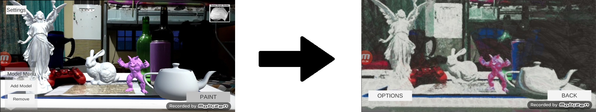

# AR-Impress-Me Version 2

Overview
-----
"Impress Me Version 2!" is an AR application that takes scenes with 3D models and apply the concept of art style Impressionism by referenced from Claude Monet using a multi-color palette scheme selection. The palettes that were used were Pre 1886, Post 1886 and Final Years Color Palette. It was developed using Unity version 2018.3.12f1 with a Vuforia plug-in, meant to be deployed on android devices. A Server must also be deployed in a personal computer using the same network as the device. ZMQ framework was used in order to communicate with sockets and images are passed as Base 64 Strings

This project uses predefined AR markers to spawn 3D models in a real world scene. It then uses computer vision to create stroke like patterns on top of the scene, creating a painting like image. Below is an illustration of this:

The left image is an example of a scene with a predefined 3D model on it, and the right is the output of the application once it has procceseed said image. Below is an illustration of how the app process is conducted, step by step:

Setup Tutorial
-----

1. Install Unity, along with the Android Build Support and Vuforia Augmented Reality Support Modules.
2. Download [OpenCVForUnity](https://assetstore.unity.com/packages/tools/integration/opencv-for-unity-21088) and import package
3. Download or Clone "Impress Me Version 2!" project and open project on Unity.
4. click the play button to run the application on the editor/and or compile the app as an apk for android devices
5. Make Sure the server is running in AR-Impress-Me/Assets/Scripts/painterly-rendering-master/server.py

Manual
-----
[User Manual.pdf](User_s_Manual.pdf)

